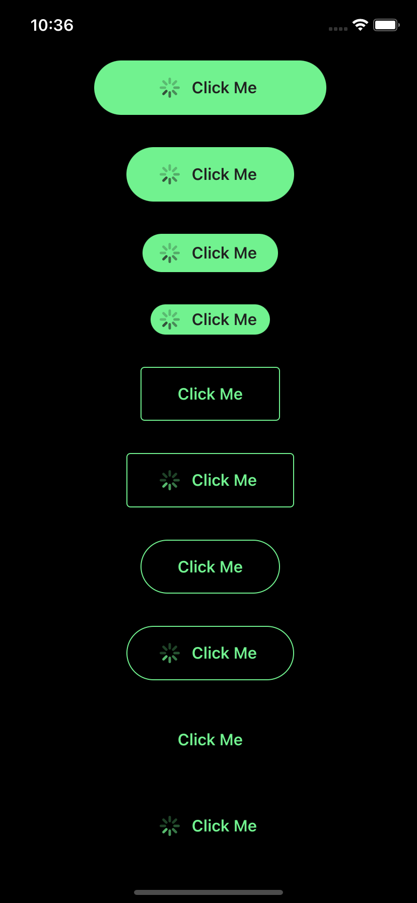
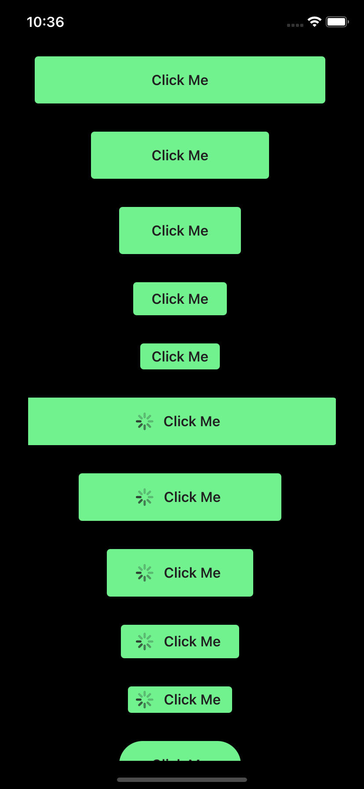
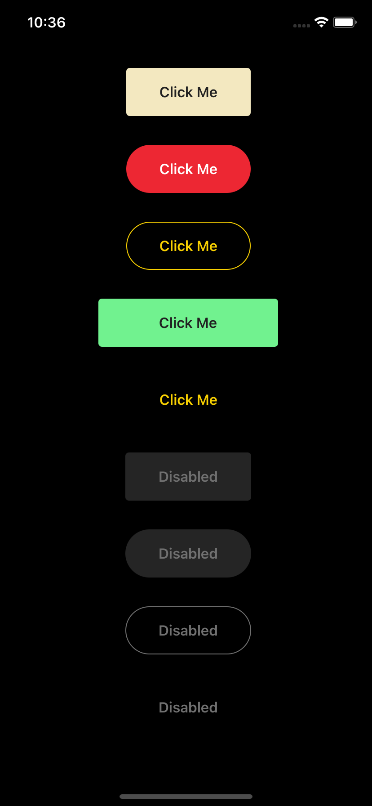

# native-x-button

[](https://github.com/semantic-release/semantic-release)

This helps you add interactive buttons. This module works with `native-x-theme` package.

## Install

### Yarn

```sh
yarn add native-x-button
```

### NPM

```sh
npm install native-x-button
```

## Usage

```tsx
import { Button } from 'native-x-button'

function MyComponent() {
  return (
    <Stack>
      <Button>Click Me</Button>
      <Button outline>Click Me</Button>
      <Button clear>Click Me</Button>
      ...
      <Button rounded>Click Me</Button>
      <Button rounded outline>
        Click Me
      </Button>
      ...
      <Button loading>Click Me</Button>
      <Button rounded loading>
        Click Me
      </Button>
      <Button icon={<Icon name='trash' />}>Delete</Button>
    </Stack>
  )
}
```

## DEMO

| Button Types               | Button Sizes               | Colors / Disabled          |
| -------------------------- | -------------------------- | -------------------------- |
|  |  |  |

## API

| Property                     | Default Value | Usage                                                          |
| ---------------------------- | ------------- | -------------------------------------------------------------- |
| disabled?: boolean           | false         | Disable the user interaction and change visual appearance      |
| outline?: boolean            | false         | Button with no background but with border color                |
| clear?: boolean              | false         | Button with no background and border color                     |
| rounded?: boolean            | false         | Show rounded corners                                           |
| loading?: boolean            | false         | Show a spinner                                                 |
| icon?: ReactNode             |               | Show an icon                                                   |
| size?: string                | 'normal'      | Valid values: 'x-small', 'small', 'normal', 'large', 'x-large' |
| backgroundColor?: string     | COLOR.ACCENT  | Any valid name of the color defined by ThemeProvider           |
| textColor?: string           | COLOR.PRIMARY | Any valid name of the color defined by ThemeProvider           |
| borderColor?: string         | COLOR.DIVIDER | Any valid name of the color defined by ThemeProvider           |
| fill?: boolean               |               | Fill the container horizontally and vertically                 |
| fillHorizontal?: boolean     |               | Fill the container horizontally                                |
| width?: number               |               | Width of the button                                            |
| height?: number              |               | Height of the button                                           |
| minWidth?: number            |               | Minimum width of the button                                    |
| minHeight?: number           |               | Minimum height of the button                                   |
| maxWidth?: number            |               | Maximum width of the button                                    |
| maxHeight?: number           |               | Maximum height of the button                                   |
| onTap: (data: TData) => void |               | Action handler for user interaction                            |
| data: TData                  | undefined     | Optional data                                                  |

## Automatic Release

Here is an example of the release type that will be done based on a commit messages:

| Commit message      | Release type          |
| ------------------- | --------------------- |
| fix: [comment]      | Patch Release         |
| feat: [comment]     | Minor Feature Release |
| perf: [comment]     | Major Feature Release |
| doc: [comment]      | No Release            |
| refactor: [comment] | No Release            |
| chore: [comment]    | No Release            |
